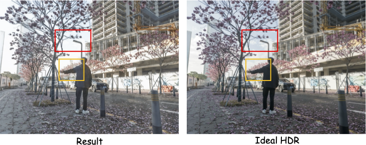

<p align="center">
  
</p>

<h1 align="center">🌟 RAIM-HDR: Multi-Exposure Image Fusion in Dynamic Scenes </h1>

<p align="center">
  <a href="README.md"></a>
  <a href="README_cn.md"></a>
  <a href="https://www.codabench.org/competitions/12728/"></a>
</p>

---

This repository provides the baseline code for **The 3rd Restore Any Image Model (RAIM) Challenge: Multi-Exposure Image Fusion in Dynamic Scenes (Track 2)** 🎯

🔗 **Competition Link**: [https://www.codabench.org/competitions/12728/](https://www.codabench.org/competitions/12728/)

## 📖 Overview

The goal of this track is to fuse multiple LDR (Low Dynamic Range) images captured at different exposure levels into a single HDR (High Dynamic Range) image, handling dynamic scenes with potential motion artifacts. ✨

Our baseline model is based on the **Uformer** architecture, adapted for multi-exposure image fusion tasks. 🚀

## 📦 Dataset

### 📥 Download

Download the dataset from: [www.example.com](https://www.example.com)

### 🗂️ Structure

The dataset should be organized as follows:

```
datasets/
├── train/
│   ├── 001/
│   │   ├── 0.jpg      # 🌑 Darkest exposure
│   │   ├── 1.jpg
│   │   ├── 2.jpg
│   │   ├── 3.jpg      # ⚖️ Middle exposure
│   │   ├── 4.jpg
│   │   ├── 5.jpg
│   │   └── 6.jpg      # ☀️ Brightest exposure
│   │   └── HDR.jpg    # 🎨 HDR image
│   ├── 002/
│   │   ├── 0.jpg
│   │   ├── ...
│   │   └── 6.jpg
│   │   └── HDR.jpg    # 🎨 HDR image
│   └── ...
└── test/
    ├── 001/
    │   ├── 1.jpg
    │   ├── ...
    │   └── 5.jpg
    └── ...
```

Each scene folder of training dataset contains 7 images (0.jpg to 6.jpg) captured at different exposure levels, ordered from darkest to brightest. 📸

## 🛠️ Installation

### 📋 Requirements

- 🐍 Python >= 3.8
- 🔥 PyTorch >= 1.12
- ⚡ CUDA >= 11.3

### 📦 Install Dependencies

```bash
pip install -r requirements.txt
```

Additional dependencies for training:

```bash
pip install opencv-python-headless timm scipy einops accelerate lmdb ftfy tqdm Pillow tensorboard
```

## 🚀 Usage

### 🏋️ Training

Start training with the provided script:

```bash
./train.sh
```

Or run manually with custom settings:

```bash
CUDA_VISIBLE_DEVICES=0,1 torchrun --nproc_per_node=2 --master_port=4392 \
    basicsr/train.py -opt options/Uformer.yml --launcher pytorch --auto_resume
```

**Key training parameters** (configured in `options/Uformer.yml`):

| Parameter            | Value  | Description               |
| -------------------- | ------ | ------------------------- |
| `batch_size_per_gpu` | 8      | Batch size per GPU        |
| `gt_size`            | 256    | Training patch size       |
| `total_iter`         | 300000 | Total training iterations |
| `lr`                 | 2e-4   | Learning rate             |
| `ema_decay`          | 0.999  | EMA decay rate            |

### 🧪 Testing / Inference

Run inference on test images:

```bash
python test_crop.py \
    --input_dir /path/to/test/images \
    --output_dir /path/to/output \
    --weights /path/to/checkpoint.pth \
    --opt options/Uformer.yml \
    --crop_size 256 \
    --crop_shave 32 \
    --factor 16
```

**Arguments:**

| Argument       | Default | Description                                |
| -------------- | ------- | ------------------------------------------ |
| `--input_dir`  | -       | Root folder containing sequence subfolders |
| `--output_dir` | -       | Output directory for fused HDR images      |
| `--weights`    | -       | Path to trained model checkpoint           |
| `--opt`        | -       | YAML config file path                      |
| `--crop_size`  | 256     | Block size for tiled inference             |
| `--crop_shave` | 32      | Overlap size for blending tiles            |
| `--factor`     | 16      | Padding factor for network stride          |

### 📊 Evaluation

Evaluate predictions against ground truth:

```bash
python eval.py \
    --pred_root /path/to/predictions \
    --gt_root /path/to/ground_truth \
    --device auto
```

**Arguments:**

| Argument      | Default | Description                              |
| ------------- | ------- | ---------------------------------------- |
| `--pred_root` | -       | Directory containing predicted images    |
| `--gt_root`   | -       | Directory containing ground truth images |
| `--device`    | auto    | Device selection (auto/cpu/cuda)         |

**Evaluation Metrics:** 📈

- 📐 **PSNR**: Peak Signal-to-Noise Ratio
- 🔍 **SSIM**: Structural Similarity Index
- 🧠 **LPIPS**: Learned Perceptual Image Patch Similarity
- 🏆 **Score**: Weighted combination following NTIRE formula

## 🎬 Example & Challenge Focus

<p align="center">
  
</p>

The figure above illustrates the key challenges in multi-exposure HDR fusion. Participants can improve their models from **two main aspects**:

### 🔴 Dynamic Range Recovery (Red Box)

| Challenge | Description |
|-----------|-------------|
| 🌑 **Under-exposure** | Dark regions lose details and appear noisy |
| ☀️ **Over-exposure** | Bright regions are saturated and washed out |
| 🎯 **Goal** | Recover full dynamic range with rich details in both shadows and highlights |

### 🟡 Motion Ghosting Removal (Yellow Box)

| Challenge | Description |
|-----------|-------------|
| 👻 **Ghosting artifacts** | Moving objects appear as semi-transparent duplicates |
| 🏃 **Motion blur** | Fast-moving subjects cause blurry edges |
| 🎯 **Goal** | Produce ghost-free HDR images with sharp moving objects |

## 📁 Project Structure

```
RAIM-HDR/
├── basicsr/                 # 🔧 Core library
│   ├── archs/              # 🏗️ Network architectures (Uformer, etc.)
│   ├── data/               # 📊 Dataset loaders
│   ├── losses/             # 📉 Loss functions
│   ├── metrics/            # 📏 Evaluation metrics
│   ├── models/             # 🤖 Training models
│   ├── ops/                # ⚙️ Custom CUDA operators
│   ├── utils/              # 🛠️ Utility functions
│   ├── train.py            # 🏋️ Training script
│   └── test.py             # 🧪 Testing script
├── datasets/               # 📦 Dataset folder
├── options/                # ⚙️ Configuration files
│   └── Uformer.yml        # 📝 Uformer training config
├── train.sh               # 🚀 Training launch script
├── test_crop.py           # 🔬 Inference script with tiling
├── eval.py                # 📊 Evaluation script
├── requirements.txt       # 📋 Python dependencies
└── README.md
```

## 📄 License

This project is released for academic research purposes. 🎓

## 🙏 Acknowledgments

- [BasicSR](https://github.com/XPixelGroup/BasicSR) - The training framework 💪
- [Uformer](https://github.com/ZhendongWang6/Uformer) - The backbone architecture 🌟

---

<p align="center">
  <b>Good luck with the challenge! 🍀🎉</b>
</p>
